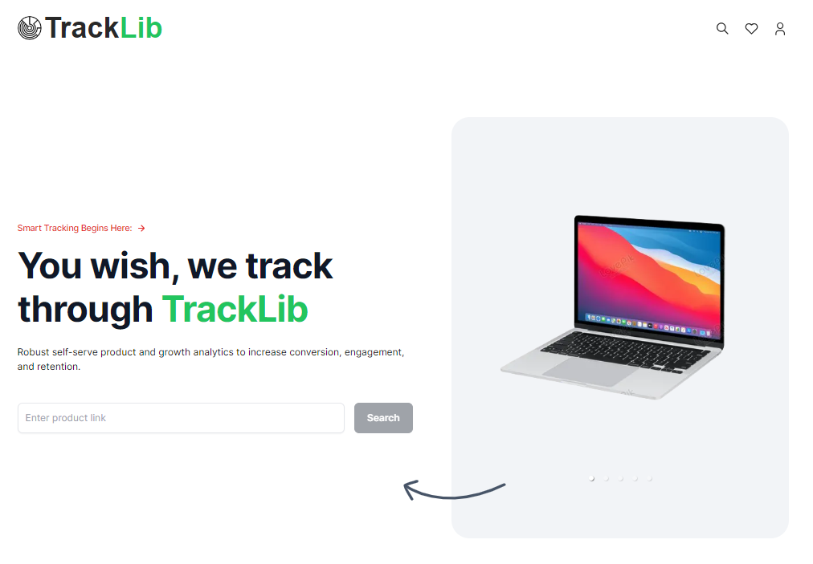
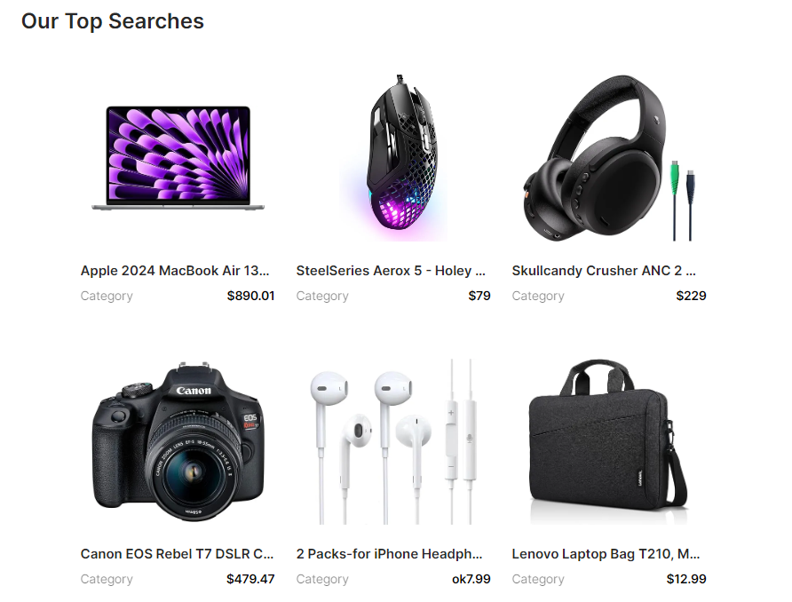
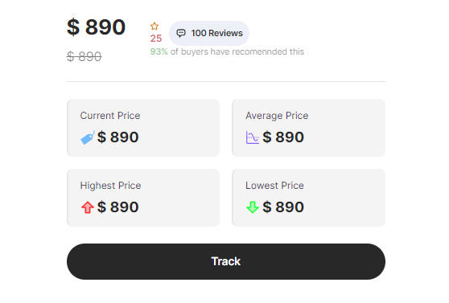
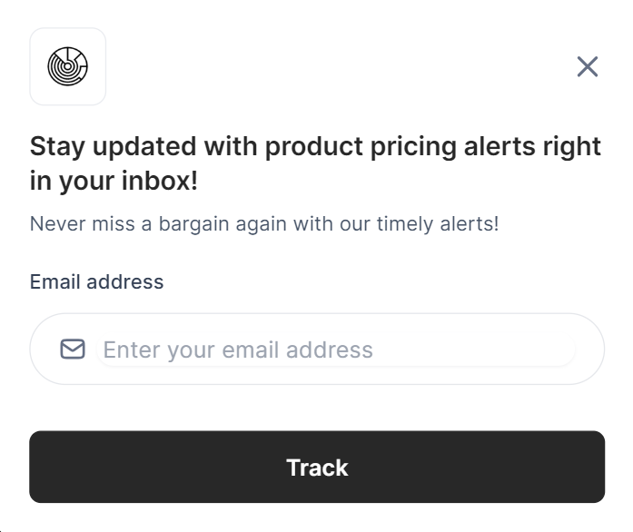

# tracklib
## Introduction

This repository showcases a web scraping website built with a focus on modern development tools. It utilizes the following technologies:

- **Next.js :** A React framework for server-side rendering and static site generation, providing a smooth user experience.
- **Tailwind CSS :** A utility-first CSS framework offering rapid and responsive design customization.
- **Node Mailer :** NodeMailer is a Node JS module that allows you to send emails from your server easily.
- **Bright Data :** A global technology company that offers web data collection and proxy services to B2B companies.

This website serves as a demonstration of my skills in building modern, responsive, and user-friendly web applications. Feel free to explore the code and see how these technologies are implemented!

## Features

- Real time data being fetching from Amazon Pakistan's official site.
- A dynamic search-bar capable of getting products from the URLs enterd and add them to our search.
- Tracking of products average-price, highest-price, lowest-price and ofcourse the current price.
- MongoDB for full data access and its aggregation, server-side JavaScript execution.
- Automatic emailing what the price reaches the preferred price.

## Tech Stack

- Next.js
- Tailwind
- NodeMailer
- Bright Data
- Cron Job

## What I learned

- Styles Tailwind CSS
- Data collection with Brigh Data
- NodeMailer's email service.
- Tailwind's reponsive webdesign
- Git commands to upload the project

# ScreenShots

### Home

### Top Searches

### Price Tracks

### Email Modal

